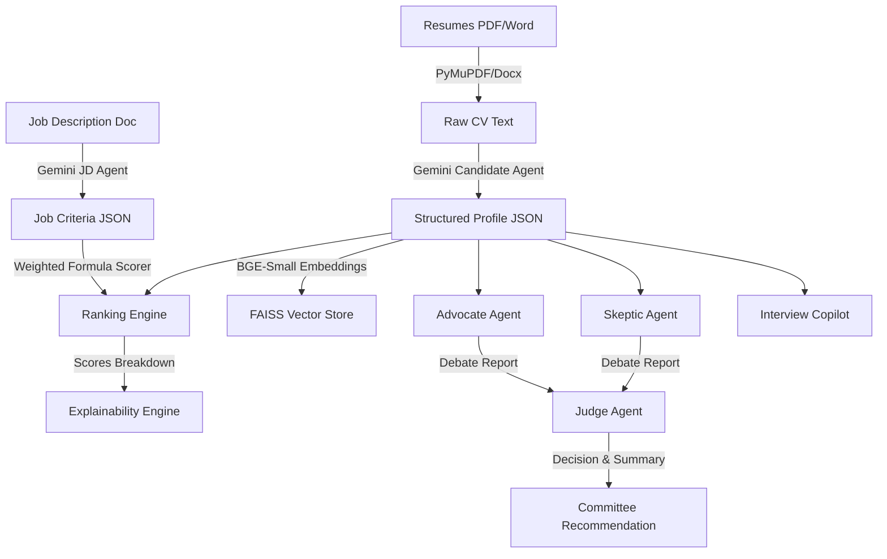

# AI Hiring Committee - Enterprise Recruitment Platform

**AI Hiring Committee** is a production-grade, enterprise-level AI-powered recruitment platform. Unlike standard Applicant Tracking Systems (ATS) or keyword-matching CRUD portals, it simulates an **Intelligent Hiring Committee** that semantically retrieves candidates, parses resumes and job requirements into structured schemas, debates candidate qualifications, details every decision, and auto-generates custom interview guides.

---

## Technical Stack & Architecture

### Frontend
- **Framework**: React + Vite + TypeScript (structured component-page topology)
- **Styling**: Vanilla CSS Variables + Tailwind CSS (Light / Dark glassmorphism SaaS styling)
- **Visualization**: Recharts (Radar charts for competencies, Area charts for scores, Pie charts for distributions)

### Backend
- **Core API Framework**: FastAPI (fully asynchronous endpoint handlers)
- **Database ORM**: SQLAlchemy with support for **PostgreSQL** (Supabase/Neon) and an automatic fallback to local **SQLite** (`sqlite:///./talent_iq.db`) to enable zero-config local starting.
- **Resume Text Extractor**: PyMuPDF (`fitz`) for PDF parsing, `python-docx` for Word, and native handlers for text docs.
- **Large Language Model**: Google Gemini 2.5 Flash via structured HTTP API handlers.
- **Embeddings & Vector Store**: `BAAI/bge-small-en-v1.5` dense embeddings locally indexed using **FAISS-CPU**, featuring a pure NumPy cosine similarity matrix fallback for 100% service uptime if compiler issues occur.
- **Document Exporting**: Styled PDF generation via ReportLab Flowables, and standard CSV generators.

---

## Core Features & Workflow



### 1. Job Description & Candidate Parsing
Recruiters upload job requirements. The **Job Spec Agent** reads text and outputs JSON containing required/preferred skills, education level, years of experience, responsibilities, and technologies. 
When resumes are uploaded, the **Candidate Agent** reads text and structures the candidate profile (experiences, projects, certifications, skills, etc.) inside the relational SQL database.

### 2. Semantic Search
Candidate profiles are encoded into dense vectors using BGE Small. An in-memory local FAISS index enables recruiters to search candidate pools semantically (e.g. searching "Backend Specialist" retrieves Python/FastAPI/REST/Docker engineers even if the phrase "Backend Specialist" is absent from their CVs).

### 3. Multi-Agent Hiring Committee
For each candidate, a simulation of three expert agents runs:
- **Advocate Agent**: Conducts a review focusing on the candidate's achievements, strengths, project complexity, and reasons to hire.
- **Skeptic Agent**: Evaluates risk factors, identifies skill gaps, analyzes short tenures, and uncovers inconsistencies.
- **Judge Agent**: Evaluates the Advocate and Skeptic briefs, and outputs a consensus summary, confidence score (0-100), and final decision (`Strong Hire`, `Hire`, `Borderline`, `No Hire`).

### 4. Explainability & Diagnostics
Calculates candidate match ratings based on weighted coefficients:
- **Skill Match**: 40%
- **Experience Depth**: 20%
- **Portfolio Projects**: 15%
- **Education Level**: 10%
- **Certifications**: 5%
- **Leadership / Ownership**: 5%
- **Soft Skills**: 5%

An **Explainability Engine** maps specific lines/statements from the resume as evidence to explain the final scores back to recruiters.

### 5. Interview Copilot & Comparison
- Automatically creates specialized interview questions (Technical, Coding, System Design, Behavioral, Leadership) classified by difficulty (Easy, Medium, Hard), focusing on candidate weakness gaps.
- Side-by-side comparison tables and charts (radar and bar) allow comparing multiple candidates at once.

---

## Local Setup Instructions

### Prerequisites
- Python 3.13+
- Node.js v22+
- Gemini API Key (obtainable from Google AI Studio)

---

### Backend Configuration

1. Navigate to the backend directory:
   ```bash
   cd backend
   ```

2. Create a virtual environment:
   ```bash
   python -m venv venv
   ```

3. Activate the virtual environment:
   - **Windows PowerShell**:
     ```powershell
     .\venv\Scripts\activate
     ```
   - **macOS/Linux**:
     ```bash
     source venv/bin/activate
     ```

4. Install python dependencies:
   ```bash
   pip install -r requirements.txt
   ```

5. Configure your environment variables in `backend/.env`:
   ```env
   # Leave blank to fallback to local SQLite (talent_iq.db)
   DATABASE_URL=
   
   # Add your Gemini API Key
   GEMINI_API_KEY=your-gemini-api-key-here
   
   JWT_SECRET=talent-iq-super-secret-key-change-me-in-production
   ```

6. Run the FastAPI backend server:
   ```bash
   python main.py
   ```
   The server will bind to `http://127.0.0.1:8000` with interactive API docs at `http://127.0.0.1:8000/docs`.

---

### Frontend Configuration

1. Navigate to the frontend directory:
   ```bash
   cd frontend
   ```

2. Install npm dependencies:
   ```bash
   npm install
   ```

3. Run the Vite development server:
   ```bash
   npm run dev
   ```
   The client application will start at `http://localhost:5173`.

---

## Quick Testing Guide

1. Open `http://localhost:5173` in your browser.
2. Sign in using the default seeded recruiter credentials:
   - **Email**: `admin@talent_iq.ai`
   - **Password**: `password123`
3. Click on **Upload JD** and upload a job description document (or paste a plain text specification).
4. Click on **Parse Resumes** (or select a Job Spec from the active selector dropdown).
5. Drag and drop multiple resume files and watch the live extraction stages (Text scanning, AI Committee Debate, Verdict consensus).
6. Click **Details** on any candidate to inspect their dossier, Advocate/Skeptic debate briefs, and download their ReportLab PDF dossier.
7. Tick checkboxes on multiple candidates in the Dashboard and click **Compare Candidates** to review side-by-side radar competency charts.
